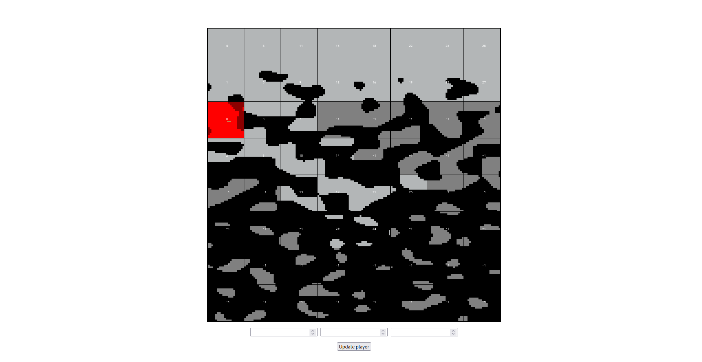

# mcrs

A voxel game engine written in Rust with WGPU. Included is a prototype of a chunk occlusion culling system by [Tommo](https://tomcc.github.io/), written in JavaScript.

I made this project to help me explore and learn Rust. I chose WGPU as a graphics backend so that the application would have been browser compatible, however multithreading in WASM is not where I want it to be for that yet.

Standard controls are used, and `k` toggles the debug menus.

## Features
- Infinite world size on all 3 axes
- Procedural 3d terrain noise
- Player physics
- ImGui debug menu
- Frustum and occlusion culling
- Downscaled rendering for style

I started this project by creating a rudimentary event system, so it should be easily modifiable for whatever features you want to add. 

## How to run
To run this project:
1. Clone the repository
2. Run `cargo run --release`. (I <3 Cargo)

To run the tests, just run `cargo test`.

All required assets are included in this repository in the assets folder, including the shaders and the texture atlas.

The `server` folder and `dev_wasm.sh` script were being used for WASM builds of this project, and are still included in case I decide to make it work with WASM again. For now, they serve no purpose to building or running this project.

To view the prototype after you've cloned the project, just open `visibility_graph_prototype/index.html` in your browser. You should see the following:

## Future Improvements
If I come back to this project in the future, I intend to add the following features:
- LOD support
- Structure generation
- Chunk and Block data serialization

The rendering boilerplate I made for my engine isn't clean or concise as I started it without much knowledge of WGPU and it's rendering pipelines. In the future I will refactor this code—thankfully Rust makes that easy. 

For now, I am taking a break from this for a while to work on other projects.

