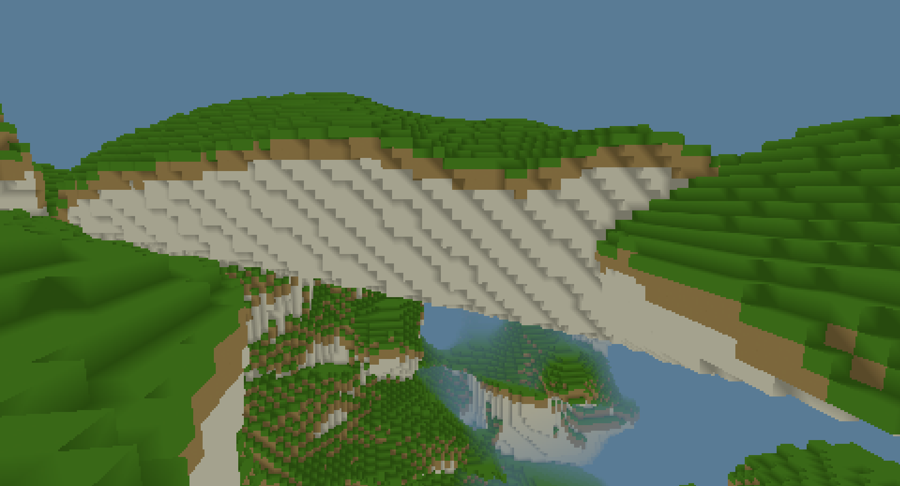

# mcrs

A voxel game engines written in Rust with WGPU. Included is a prototype of a chunk occlusion culling system by [Tommo](https://tomcc.github.io/), written in javascript.

I made this project to help me explore and learn Rust. I chose WGPU as a graphics backend so that the application would have been browser compatible, however multithreading in WASM is not where I want it to be for that yet.

## Features
- Infinite world size on all 3 axes
- Procedural 3d terrain noise
- Player physics
- ImGui debug menu
- Frustum and occlusion culling
- Downscaled rendering for style

I started this project by creating a rudimentary event system, so it should be easily modifiable with whatever features you want to add. If I come back to this project in the future, I will change how chunks are managed to allow for LODs and structures.

## How to run
To run this project:
1. Clone the repository
2. Run `cargo run --release`. (I <3 Cargo)

All required assets are included in this repository in the assets folder, including the shaders and the texture atlas.
